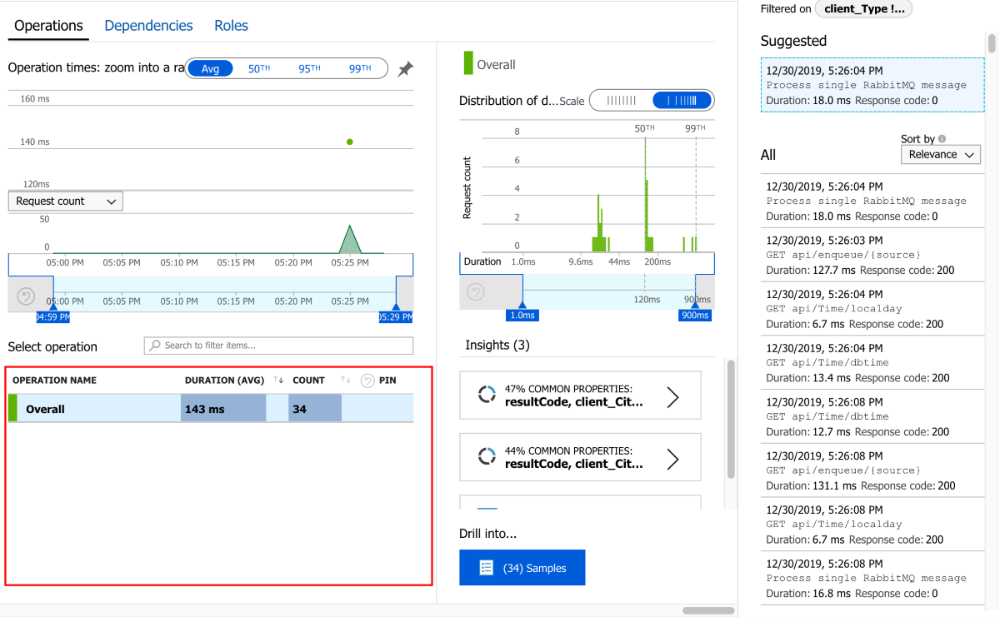
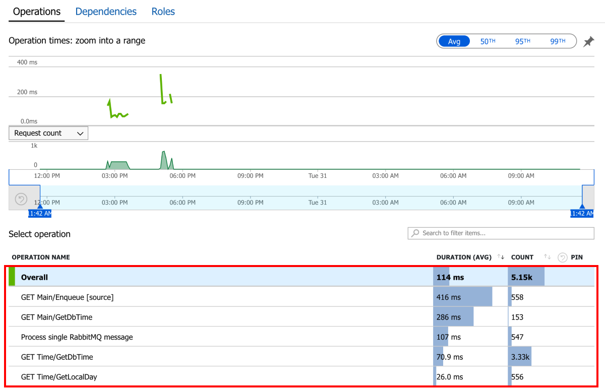
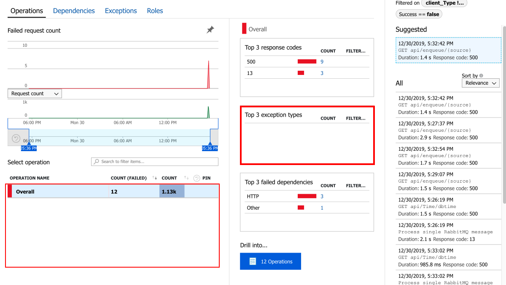
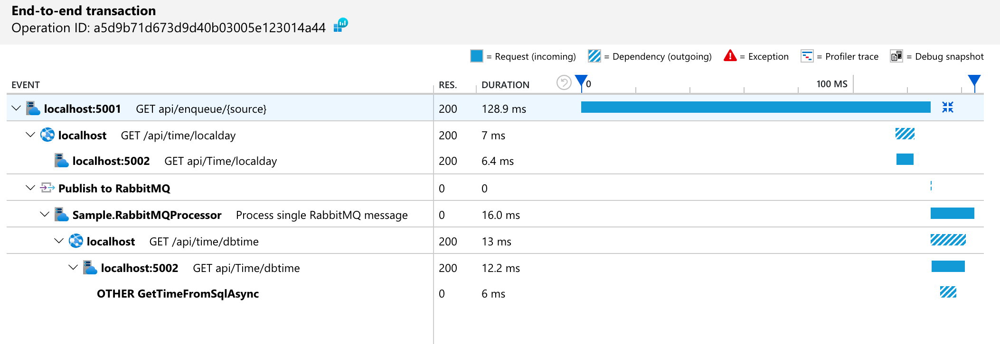
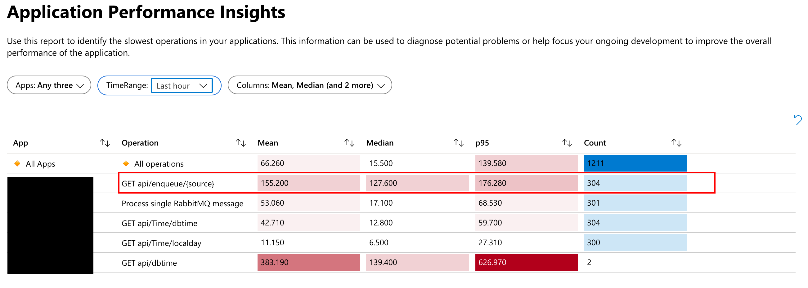
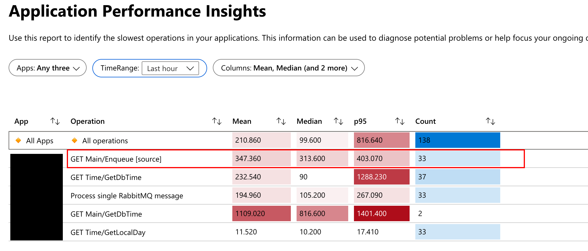

# Using OpenTelemetry with Application Insights

Using Azure Application Insights through OpenTelemetry SDK is an option available to those who wish to keep the code base flexible by depending on a standard API. It is important to notice the following differences when using it OpenTelemetry instead of the Application Insights SDK:

## 1. Live metrics stream is not supported

At least out of the box, live metrics stream won't work.

## 2. Nameless operations

In `Performances` operations don't have a name and are all grouped as 1 item. Going to details let's you differentiate them.

No operation name using OpenTelemetry SDK:

Operation name exists using Application Insights SDK:

Using OpenTelemetry, the granularity is exposed as request name.

## 3. Failures: nameless and missing exception type

The same happens in `Failures`, all operations are grouped into 1 item. Moreover, the exception type is not available
Using OpenTelemetry SDK:

Using AI SDK:

## 4. Difference in first request duration

When building traces for asynchronous transactions (publisher/consumer) the starting request duration is different depending on the SDK used.

With Application Insights SDK the request duration seems to be the total time. On the other hand, using OpenTelemetry SDK, it seems to have only the self time.

Application Insights SDK:

Open Telemetry SDK:

When using the Jaeger exporter the starting request has the self time as duration (as with OpenTelemetry + Application Insights exporter):

This difference is also visible in Application Insights/Workbooks/Application Performance Insights.

OpenTelemetry SDK has only the self time:

Application Insights SDK has the total time:

For me, the ideal solution would be:

- Allow visualization and alerting on end-to-end transaction duration (total time)
- Include self time of requests starting an asynchronous trace