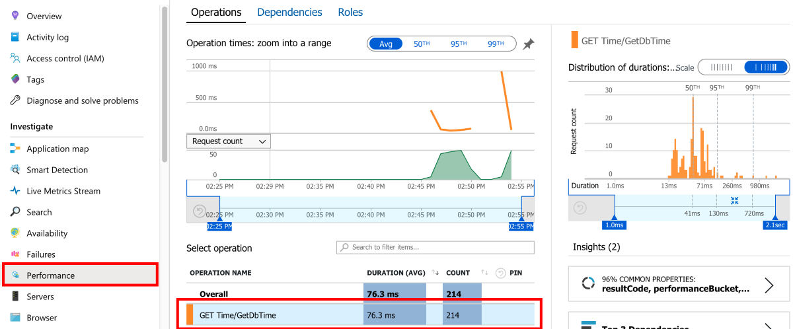
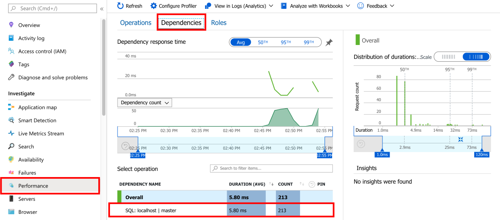

# Scenario 1: REST API accessing SQL Server

REST API with dependency on SQL Server.


## Observability requirements

In order to fulfill the observability requirements for this scenario the following information should be collected:

1. Duration of API requests
2. Duration of SQL operations
3. Log information containing SQL Server response

## Implementation

Both OpenTelemetry and Application Insights SDK offer out-of-the-box support for http requests collection. At the time of writing, only Application Insights supported SQL Server tracing collection (pending PR with SQL collector is found [here](https://github.com/open-telemetry/opentelemetry-dotnet/pull/355)). A simple way to add SQL Server tracing using Open Telemetry is to create the spans before calling SQL Server:

```C#
var span = this.tracer.StartSpan(nameof(GetTimeFromSqlAsync), SpanKind.Client);
try
{
  
    return await this.repository.GetTimeFromSqlAsync();
}
catch (Exception ex)
{
    span.Status = Status.Internal.WithDescription(ex.ToString());
    throw;
}
finally
{
    span.End();
}
```

Recapping: besides the custom SQL dependency tracking needed for OpenTelemetry, **no custom code (besides SDK bootstrapping) is required**.

## Requirement validation

### 1. Duration of API requests

In Jaeger UI, traces can be filtered by service and operation, displaying an overview:


In Application Insights the same information is available under Performance:



### 2. Duration of SQL operations

In Jaeger, clicking on a trace display detailed information, including the SQL call duration:


In Application Insights we can either view as dependencies:



Or as part of the end-to-end transaction:


### 3. Log information containing SQL Server response

As the sample application is using Application Insights as logging provider the screenshot below shows how the log can be scoped to the end-to-end transaction.


This is powerful. If you have distinct system taking care of tracing and logging finding logs for a trace won't be so simple.

## Running this scenario

In order to run this scenario locally ensure the following requirements are met:

- SQL Server is available at `server=localhost;user id=sa;password=Pass@Word1;`<br/>
A way to accomplish it is to run as a linux docker container:

```bash
docker run --name sqlserver -e "ACCEPT_EULA=Y" -e "SA_PASSWORD=Pass@Word1" -p 1433:1433 -d mcr.microsoft.com/mssql/server:2019-GA-ubuntu-16.04
```

- When using OpenTelemetry, ensure Jaeger is running locally

```bash
docker run -d --name jaeger \
        -e COLLECTOR_ZIPKIN_HTTP_PORT=9411 \
        -p 5775:5775/udp \
        -p 6831:6831/udp \
        -p 6832:6832/udp \
        -p 5778:5778 \
        -p 16686:16686 \
        -p 14268:14268 \
        -p 9411:9411 \
        jaegertracing/all-in-one
```

- When using Application Insights (set USE_APPLICATIONINSIGHTS=1 and USE_OPENTELEMETRY=0), ensure the instrumentation key is set (APPINSIGHTS_INSTRUMENTATIONKEY). The sample project has a simple way to provide settings to all applications. In folder ./shared create a file called `appsettings.Development.json`.

To run the sample start the project Sample.TimeApi. To generate load use the following script:

```bash
watch -n 1 curl --request  GET http://localhost:5002/api/time/dbtime
```

## Where to go next

- [Back to overview](./README.md)
- [Scenario 2: REST API call chain](./scenario2.md)