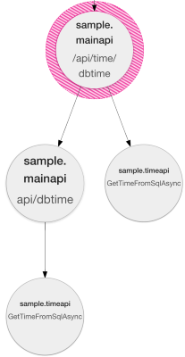
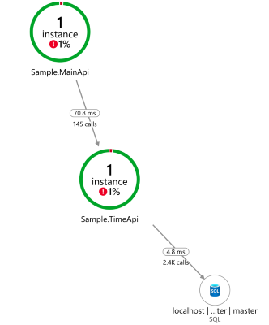

# Scenario 2: REST API call chain

This scenario is an evolution from Scenario 1, containing a REST API in front of the time API. In this case trace will have to be transport between two processes over HTTP.


## Observability requirements

The additional requirement is:

1. End to end transaction details containing both REST APIs and the SQL dependency

## Implementation

.NET Core 3.0 simplifies distributed tracing by having built-in HTTP tracing correlation. The only required code change is to set the desired activity id format to W3C.

```C#
public static void Main(string[] args)
{
    Activity.DefaultIdFormat = ActivityIdFormat.W3C;
    Activity.ForceDefaultIdFormat = true;
    CreateHostBuilder(args).Build().Run();
}
```

The class `System.Diagnostics.Activity` is used by libraries to generate traces that can be observed by Diagnostic Listeners in order to generate spans/operations according to the tracing backend of choice. Examples are [Http Client](https://github.com/dotnet/corefx/blob/master/src/System.Diagnostics.DiagnosticSource/src/HttpCorrelationProtocol.md) and [Azure Service Bus](https://docs.microsoft.com/en-us/azure/service-bus-messaging/service-bus-end-to-end-tracing).

 As mentioned before, correlation happens by having spans sharing the same TraceID. To propagate the traceId used in first span http request headers are used. The forwarded value will then be used to argument new traces, correlating with the value used by the caller.

|Name|SpanId|ParentId|TraceId|
|-|-|-|-|
|main api http get|41d990c15431a48b||cd4262a7f7adf040bdd892959cf8c4fc|
|call time api|4a28d39ff0e725f2|41d990c15431a48b|cd4262a7f7adf040bdd892959cf8c4fc|
|time api http get|4dcd0354450f7920|4a28d39ff0e725f2|cd4262a7f7adf040bdd892959cf8c4fc|
|sql call|48475897d66c3b03|4dcd0354450f7920|cd4262a7f7adf040bdd892959cf8c4fc|

The header propagating the correlation is named `traceparent`, as [defined by W3C](https://www.w3.org/TR/trace-context-1/), on it's simplest form contains a value with the following pattern:

```text
00-cd4262a7f7adf040bdd892959cf8c4fc-4a28d39ff0e725f2-01
```

As you can observe there are 4 fields in the header value, separated by a '-':

- [Version](https://www.w3.org/TR/trace-context-1/#version): currently 00
- [TraceId](https://www.w3.org/TR/trace-context-1/#trace-id): The trace identifier started by caller
- [ParentId](https://www.w3.org/TR/trace-context-1/#parent-id): The span identifier that originated the call
- [Trace flags](https://www.w3.org/TR/trace-context-1/#sampled-flag): current version only supported the flag `sampled` which indicates if the caller is sampling the request

## Requirement validation

### 1. End to end transaction details containing both REST APIs and the SQL dependency

In Jaeger UI, we can observe two services as part of the transaction:


Moreover, we can look at the dependency graph between services:



The same applies to Application Insights:


The dependency graph in Application Insights is available under Application Map:



## Running this scenario

In order to run this scenario locally ensure that following requirements are met:

- SQL Server is available at `server=localhost;user id=sa;password=Pass@Word1;`<br/>
A way to accomplish it is to run as a linux docker container:

```bash
docker run --name sqlserver -e "ACCEPT_EULA=Y" -e "SA_PASSWORD=Pass@Word1" -p 1433:1433 -d mcr.microsoft.com/mssql/server:2019-GA-ubuntu-16.04
```

- When using OpenTelemetry, ensure Jaeger is running locally

```bash
docker run -d --name jaeger \
        -e COLLECTOR_ZIPKIN_HTTP_PORT=9411 \
        -p 5775:5775/udp \
        -p 6831:6831/udp \
        -p 6832:6832/udp \
        -p 5778:5778 \
        -p 16686:16686 \
        -p 14268:14268 \
        -p 9411:9411 \
        jaegertracing/all-in-one
```

- When using Application Insights (set USE_APPLICATIONINSIGHTS=1 and USE_OPENTELEMETRY=0), ensure the instrumentation key is set (APPINSIGHTS_INSTRUMENTATIONKEY). The sample project has a simple way to provide settings to all applications. In folder ./shared create a file called `appsettings.Development.json`.

To run the sample start the projects Sample.TimeApi and Sample.MainApi. To generate load use the following script:

```bash
watch -n 1 curl --request  GET  http://localhost:5001/api/dbtime
```