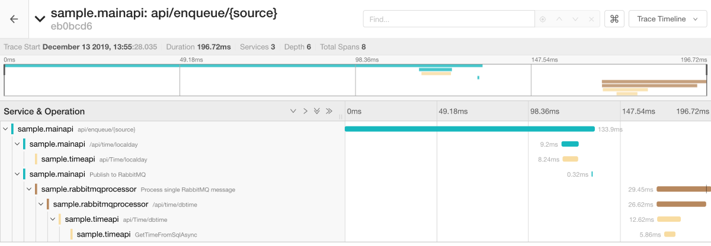

# Scenario 3: Asynchronous transactions

This scenario covers asynchronous transactions using RabbitMQ queues. In that case the correlation is our responsibility.


## Observability requirements

1. Include all services as part of the trace
2. Include RabbitMQ publishing activity
3. Have metrics aggregating enqueued items by source

## Implementation

It is necessary to write custom code to correlate RabbitMQ message consumption with the trace that generated the message. The sample application uses RabbitMQ message headers to include the trace parent of a each message.

In publisher:

```c#
var props = channel.CreateBasicProperties();
props.Headers = new Dictionary<string, object>();
props.Headers.Add("traceparent", "00-cd4262a7f7adf040bdd892959cf8c4fc-4a28d39ff0e725f2-01");

channel.BasicPublish("", QueueName, props, System.Text.Encoding.UTF8.GetBytes(message))
```

In consumer:

```c#
if (rabbitMessage.BasicProperties.Headers.TryGetValue(TraceParent.HeaderKey, out var rawTraceParent) && rawTraceParent is byte[] binRawTraceParent)
{
    // parse "00-cd4262a7f7adf040bdd892959cf8c4fc-4a28d39ff0e725f2-01" into
    // version
    // traceId
    // parentId
    // flags
}
```

Once we have the parent and trace ids we need to start the consumer activity referencing them.

For OpenTelemetry:

```C#
var parentContext = new SpanContext(traceId, parentId, ActivityTraceFlags.Recorded, isRemote: true);
tracer.StartActiveSpan("Process single RabbitMQ message", parentContext, SpanKind.Consumer, out span);
```

For Application Insights:

```C#
using (var operation = telemetryClient.StartOperation<RequestTelemetry>("Process single RabbitMQ message", traceId, parentId))
{
    ...
}
```

The requirement to track RabbitMQ publishing also requires additional code. The easier option is to use the target SDK and create spans/operations before calling RabbitMQ (as we did for SQL server in Open Telemetry).

The second option is to create what a SDK provider would have to in order to make simplify trace collector implementation. Through the usage of System.Diagnostics.Activity the activities are created. The actual creation of spans happens by listening to the diagnostics source.

Code added to RabbitMQ publisher to generate activities:

```C#
static DiagnosticSource diagnosticSource = new DiagnosticListener("Sample.RabbitMQ");

public void Publish(string message, string traceId, string spanId)
{
    Activity activity = null;
    if (diagnosticSource.IsEnabled("Sample.RabbitMQ"))
    {
        activity = new Activity("Publish to RabbitMQ");
        activity.AddTag("operation", "publish");
        activity.AddTag("host", HostName);
        activity.AddTag("queue", QueueName);
        diagnosticSource.StartActivity(activity, null);
    }

    // publish to RabbitMQ

    if (activity != null)
    {
        diagnosticSource.StopActivity(activity, null);
    }
}
```

The collector needs to subscribe to diagnostics source and create the appropriate target SDK span object. The sample project has a simplified implementation. For production quality please refer to OpenTelemetry and/or Application Insights built-in collectors and this [user guide](https://github.com/dotnet/corefx/blob/master/src/System.Diagnostics.DiagnosticSource/src/ActivityUserGuide.md).

For OpenTelemetry this is how it looks like:

```C#
public class RabbitMQListener : ListenerHandler
{
    public override void OnStartActivity(Activity activity, object payload)
    {
        this.Tracer.StartSpanFromActivity(activity.OperationName, activity);
    }

    public override void OnStopActivity(Activity activity, object payload)
    {
        var span = this.Tracer.CurrentSpan;
        span.End();
        if (span is IDisposable disposableSpan)
        {
            disposableSpan.Dispose();
        }
    }
}

subscriber = new DiagnosticSourceSubscriber(new RabbitMQListener("Sample.RabbitMQ", tracer), DefaultFilter);
subscriber.Subscribe();
```

The metrics requirements is simple to achieve using Application insights SDK:

```C#
// Create the metric with custom dimension "Source"
var itemEnqueuedMetric = telemetryClient.GetMetric(new MetricIdentifier("Sample App", "Enqueued Item", "Source"));

// Add items to metric
itemEnqueuedMetric.TrackValue(metricValue, "WebSite");
```

## Requirement validation

### 1. Include all services as part of the trace

In Jaeger UI, all services are part of the trace details:



In Application insights the transaction looks like this:


### 2. Include RabbitMQ publishing activity

As displayed above, the `Publish to RabbitMQ` activity has it's own span, for both Jaeger and Application Insights.

### 3. Have metrics aggregating enqueued items by source

In the sample application metrics have been implemented with OpenTelemetry (Prometheus exporter) and Application Insights (through the SDK).

The metrics using Prometheus (and Grafana for visualization) looks like this:


The raw metrics are available in [](http://localhost:9184/metrics), as the example below:

```text
# HELP Enqueued_ItemSample AppEnqueued Item
Enqueued_Item{Source="WebSiteB"} 1 1578051759271
# HELP Enqueued_ItemSample AppEnqueued Item
Enqueued_Item{Source="WebSiteC"} 0 1578051759271
# HELP Enqueued_ItemSample AppEnqueued Item
Enqueued_Item{Source="WebSiteA"} 2 1578051759271
```

Visualization for Application Insights is available under "Metrics":


## Running this scenario

In order to run this scenario locally ensure the following requirements are met:

- SQL Server is available at `server=localhost;user id=sa;password=Pass@Word1;`<br/>
A way to accomplish it is to run as a linux docker container:

```bash
docker run --name sqlserver -e "ACCEPT_EULA=Y" -e "SA_PASSWORD=Pass@Word1" -p 1433:1433 -d mcr.microsoft.com/mssql/server:2019-GA-ubuntu-16.04
```

- RabbitMQ is available at localhost:

```bash
docker run -d --hostname -rabbit --name test-rabbit -p 15672:15672 -p 5672:5672 rabbitmq:3-management
```

- When using OpenTelemetry, ensure Jaeger is running locally

```bash
docker run -d --name jaeger \
        -e COLLECTOR_ZIPKIN_HTTP_PORT=9411 \
        -p 5775:5775/udp \
        -p 6831:6831/udp \
        -p 6832:6832/udp \
        -p 5778:5778 \
        -p 16686:16686 \
        -p 14268:14268 \
        -p 9411:9411 \
        jaegertracing/all-in-one
```

- When using OpenTelemetry, in order to visualize metrics ensure Grafana and Prometheus are running locally

```bash
docker-compose up
```

To visualize it, open Grafana on your browser at [http://localhost:3000](http://localhost:3000) (credentials are admin/password1). Add Prometheus as data source (URL is http://prometheus:9090).


- When using Application Insights (set USE_APPLICATIONINSIGHTS=1 and USE_OPENTELEMETRY=0), ensure the instrumentation key is set (APPINSIGHTS_INSTRUMENTATIONKEY). The sample project has a simple way to provide settings to all applications. In folder ./shared create a file called `appsettings.Development.json`.

To run the sample start the projects Sample.TimeApi, Sample.MainApi and Sample.RabbitMQProcessor. To generate load use the following scripts:

Enqueuing from "WebSiteA" every 2 seconds

```bash
watch -n 2 curl --request GET http://localhost:5001/api/enqueue/WebSiteA
```

Enqueuing from "WebSiteB" every 10 seconds

```bash
watch -n 10 curl --request GET http://localhost:5001/api/enqueue/WebSiteB
```

Enqueuing from "WebSiteC" every 30 seconds

```bash
watch -n 30 curl --request GET http://localhost:5001/api/enqueue/WebSiteC
```

## Where to go next

- [Back to overview](./README.md)